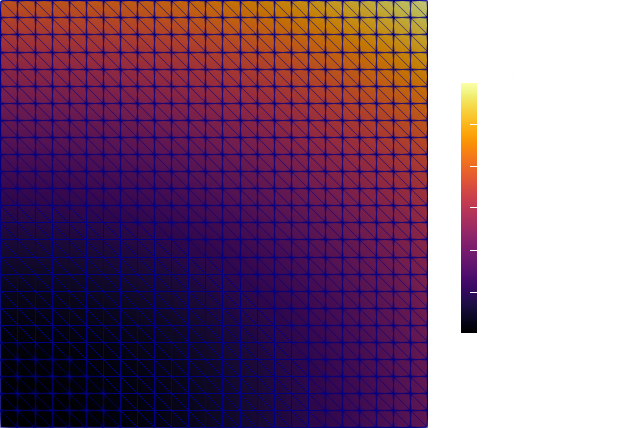
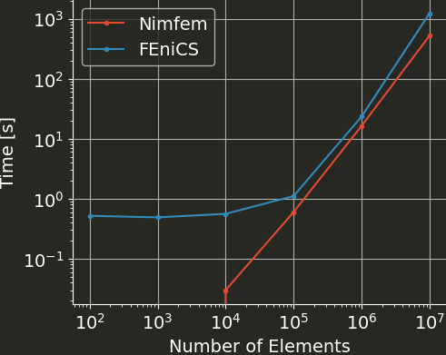

Title: Nimfem
Date: 2020-10-25
Category: Numerics

I've written a finite element library. Let's talk about it.

Motivation
----------

The initial inspiration came from watching the talk [“Preventing the Collapse of Civilization”](https://www.youtube.com/watch?v=pW-SOdj4Kkk) by Jonathan Blow, which I highly recommend.
Essentially, its about the loss of understanding in software development when piling abstractions on top of each other.
And while an FEM library might not be an Electron app, at least I didn't understand in detail how sparse matrices are stored and sparse linear systems are solved.
So I wrote all of this from scratch to rectify that.

Solving the Poisson equation
----------------------------

To have something to compare to, I implemented a solver for the Poisson equation as in the [first example of the FEniCS tutorial](https://fenicsproject.org/pub/tutorial/html/._ftut1004.html). That is, solve
$$-Δu = f$$
subject to
$$u = u_D \text{ on } Γ_D$$
with
$$\begin{aligned} u_D &= 1 + x^2 + 2y^2 \\\\
f &= - 6 \end{aligned}$$
on a unit square.
And I can report that it works:

 
So I'm very happy with that. Here is what the main file to achieve that looks like:
~~~nim 
import nimfem

proc myF(x: Vector[2], J: Matrix[2, 2]): Matrix[3, 3] =
  let B = inv(J) * derivativeShapeFunctions()
  result = B.transpose * B

proc mySource(x: Vector[2], J: Matrix[2, 2]): Vector[3] =
  let N = shapeFunctions(x)
  result = - 6.0 * N

proc bc(x: Vector[2]): float =
  result = 1.0 + x[0]*x[0] + 2.0*x[1]*x[1]

let my_mesh = UnitSquareMesh(50)

var A = assembleMatrix(myF, my_mesh)
var f = assembleVector(mySource, my_mesh)

setDiagonalRows(A, my_mesh.boundary_nodes)
applyBC(f, my_mesh, bc)

var P = incomplete_lu(A)
var u = preconditioned_cg(A, P, f)

writeVTK(my_mesh, u)

echo "Number of elements: ", my_mesh.connectivity.len
~~~

That ain't so bad, if I might say so.

Size & Scope
------------

If you're unfamiliar with [Nim](https://nim-lang.org), you can see that the syntax is quite succint and Pythonesque. The whole library (right now) does

- Dense linear algebra
- Sparse matrices
- mesh generation (unit square discretized w/ triangles)
- first order lagrange triangle elements
- gauss quadrature for those
- vector and matrix assembly
- BC application
- linear solver: conjugate gradient, preconditioned CG, incomplete LU
- VTK output

while coming in at less than 500 lines of code. The compactness is one of the reasons I like Nim. The other is that there is nothing Pythonesque about the speed.

Speed
-----

Here is a quick comparison of runtimes for various mesh sizes between this Nimfem solver and the equivalent (I think) FEniCS version.

Note that for small meshes, the FEniCS runtime is dominated by the Python startup time.
For Nimfem, the runtime for the meshes with 100 and 1000 elements is below the resolution of `/usr/bin/time` (one hundredth of a second).
The smallest speedup is at 1 million elements with 43%, and for 10 million elements, Nimfem is more than twice as fast as FEniCS.
On the one hand, Nimfem doesn't have a fraction of the features, and all the sizes for element matrices for example can be hardcoded, so that might make it quite quick.
On the other hand, there is basically no optimization in the code, and I didn't think I would be able to beat PETSc at solving the linear system, which is naturally what dominates the runtime.

Epilogue
--------

Initially I had intended to make this a small tutorial series on writing an FEM library from scratch, but a) it has been quite a while since the majority of the code was written and b) I have unfortunately lost all my notes I had taken while implementing it.
Both make unenthusiastic about doing that now.

If you want to have a look, all the code lives at [https://github.com/Psirus/Nimfem](https://github.com/Psirus/Nimfem).
